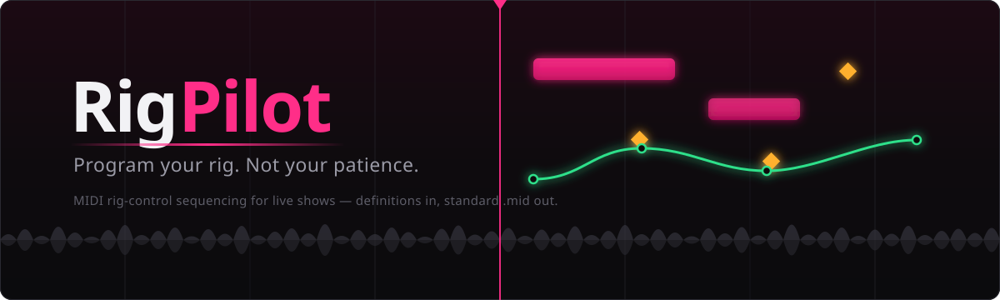
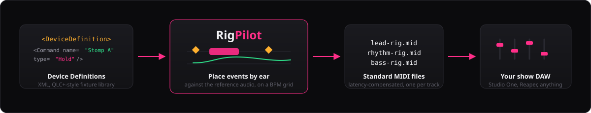
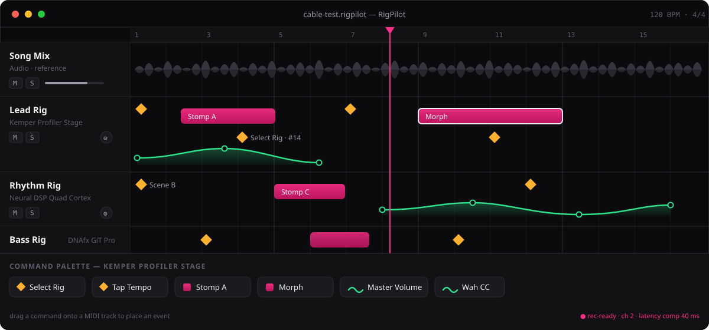
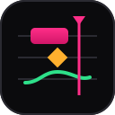

<div align="center">



<br/>

[](https://github.com/FlmBus/rigpilot/actions/workflows/build.yml)
[](https://github.com/FlmBus/rigpilot/releases/latest)
[](LICENSE)
[](https://tauri.app)
[](https://svelte.dev)
[](https://www.rust-lang.org)

**The MIDI rig-control sequencer for bands that run timed live shows.**

Drop commands on a timeline, line them up with your song by ear,
export standard `.mid` files that just work in your show DAW.

[Download](#-download) · [How it works](#-how-it-works) · [Device library](#-device-library) · [Build from source](#%EF%B8%8F-building-from-source)

</div>

---

## 🎸 The problem

Your amp modeler switches presets via MIDI. Your DAW plays a click and backing tracks.
Connecting the two means digging through MIDI implementation charts and hand-typing raw
`CC#47 value 3`-style events into a DAW — for every preset change, every stomp, every
volume fade, for every band member, for every song. It's tedious, error-prone, and
nobody remembers what `PC 14 on channel 2` meant three rehearsals later.

**RigPilot fixes this the way lighting software fixed it years ago:** device definitions
describe *what your gear can do* in plain language ("Stomp A", "Select Rig", "Master
Volume") — you just place named commands on a timeline.



## ✨ What it looks like



> One project = one song. Audio tracks are your reference — the mix or stems, so you can
> place events *by ear*. Each MIDI track controls one device and exports to one `.mid` file.

## 🧩 How it works

Every command from a device definition has one of three behaviors, color-coded on the timeline:

| | Type | What it does | Looks like |
|---|---|---|---|
| 🟡 | **One-Shot** | Fires once at a point in time — preset changes, tap tempo, scene switches | Diamond marker, centered on its tick |
| 🩷 | **Hold** | Engage messages at block start, disengage at block end — stomps, sustains | Resizable block |
| 🟢 | **Automation** | A value curve over time targeting a MIDI CC — volume fades, wah sweeps | Breakpoint curve |

And the workflow is exactly four steps:

1. **Import** your song mix (or stems) as reference audio.
2. **Add a MIDI track** per device, pick its definition and MIDI channel.
3. **Drag commands** from the palette onto the timeline — snap grid, multi-select,
   copy/paste, undo, the works.
4. **Export** — one standard MIDI file per track, with per-device **latency
   compensation** baked in (slow preset loads get their messages sent early, so the
   switch lands *on* the beat, not after it).

The exported files import cleanly into **Studio One**, **Reaper**, or any DAW that can
play a MIDI track to an output port. RigPilot never needs to be on stage.

## 🎛️ Device library

Definitions are QLC+-style XML files validated against [an XSD](definitions/device-definition-1.xsd) — no
code required to add a device. Shipped so far:

| Device | Definition |
|---|---|
| Fractal Audio Axe-Fx III | [`fractal-axe-fx-iii.xml`](definitions/fractal-axe-fx-iii.xml) |
| Harley Benton DNAfx GiT Pro | [`harley-benton-dnafx-git-pro.xml`](definitions/harley-benton-dnafx-git-pro.xml) |
| HeadRush Prime | [`headrush-prime.xml`](definitions/headrush-prime.xml) |
| Kemper Profiler Stage | [`kemper-profiler-stage.xml`](definitions/kemper-profiler-stage.xml) |
| Neural DSP Quad Cortex | [`neural-dsp-quad-cortex.xml`](definitions/neural-dsp-quad-cortex.xml) |

A definition declares **Commands** (name, type, group, parameters, MIDI messages),
optional **Init Messages** for putting the device into a known state, and per-command
**latency** hints. Imported definitions are embedded into the project file, so a
`.rigpilot` project zipped up and sent to a bandmate *just works*.

```xml
<Hold id="stomp-a" name="Stomp A" group="Stomps"
      description="Stomp A is ON for the duration of the block, OFF afterwards.">
  <Engage>
    <ControlChange controller="99" value="50"/>
    <ControlChange controller="98" value="3"/>
    <ControlChange controller="6"  value="0"/>
    <ControlChange controller="38" value="1"/>
  </Engage>
  <Disengage>…</Disengage>
</Hold>
```

*(real excerpt from the Kemper definition — four raw NRPN messages you'll never have to type again)*

**Your device is missing?** Definitions are hand-writable in an afternoon with the
device's MIDI implementation chart — PRs welcome.

## 📦 Download

Grab the latest build from the [**Releases page**](https://github.com/FlmBus/rigpilot/releases/latest):

| Platform | Package |
|---|---|
| 🪟 Windows x64 | `.exe` installer (NSIS) or `.msi` |
| 🍎 macOS (Apple Silicon) | `RigPilot_*_arm64.dmg` |
| 🍎 macOS (Intel) | `RigPilot_*_x86_64.dmg` |
| 🐧 Linux x64 | `.AppImage`, `.deb` or `.rpm` |

> [!NOTE]
> Builds are currently **unsigned and un-notarized** (RigPilot ships without a paid
> Apple Developer certificate). On Windows, SmartScreen asks once whether you're sure.
> You are. On macOS, see below.

### 🍎 macOS: *"RigPilot is damaged and can't be opened"*

The app isn't damaged. Because the build is un-notarized, macOS — especially on Apple
Silicon (M-series) — attaches a **quarantine flag** to anything downloaded through a
browser and Gatekeeper then refuses to launch it with that misleading message.

**One-liner install** — picks the right build for your Mac, installs it into
`/Applications`, and clears the quarantine flag:

```zsh
curl -fsSL https://raw.githubusercontent.com/FlmBus/rigpilot/main/scripts/install-macos.sh | bash
```

Then launch RigPilot from your Applications folder. Re-run the same command any time to
update to the latest release. (Script source: [`scripts/install-macos.sh`](scripts/install-macos.sh).)

**Prefer to do it by hand?** Drag RigPilot into `/Applications`, then strip the flag once:

```bash
xattr -dr com.apple.quarantine /Applications/RigPilot.app
```

The old right-click → *Open* trick often no longer works on recent Apple Silicon macOS,
so the `xattr` command is the reliable route.

> [!TIP]
> Files that don't arrive through a quarantining app never get flagged. If you copy the
> `.app` over via `scp`, USB, or your local network instead of a browser download, no
> workaround is needed at all.

## 🛠️ Building from source

Prerequisites: [Node 22+](https://nodejs.org), [Rust stable](https://rustup.rs), and the
[Tauri 2 system dependencies](https://tauri.app/start/prerequisites/) for your OS.

```bash
git clone https://github.com/FlmBus/rigpilot.git
cd rigpilot/app
npm ci
npm run tauri dev     # hot-reloading dev build
npm run tauri build   # release bundles for your platform
```

CI builds all four targets (Linux, Windows, macOS arm64 + x86_64) on every push and
attaches the bundles to a GitHub release on every `v*` tag — see
[`build.yml`](.github/workflows/build.yml).

## 🗂️ Repository layout

```
rigpilot/
├── app/                  # the desktop app
│   ├── src/              #   SvelteKit frontend (timeline, palette, inspector)
│   └── src-tauri/        #   Rust backend (project files, MIDI export)
├── definitions/          # device definition library + XSD schema
├── docs/                 # intent, plan, terminology — the project's brain
└── examples/             # example .rigpilot projects
```

The [`docs/terminology.md`](docs/terminology.md) glossary is canonical: UI labels, code
identifiers, and file-format fields all use those exact terms.

## 🤝 Contributing

The most valuable contribution is a **device definition** for gear we don't have.
Beyond that: bug reports with a `.rigpilot` project attached are gold, and the
[backlog](docs/backlog.md) shows where the project is headed.

## 📄 License

[MIT](LICENSE) — do what you want, just don't blame us when your guitarist
still misses his cue.

---

<div align="center">



**Built with 🤘 by a band that got tired of typing CC numbers.**

*One-shots fire. Holds sustain. Automation sweeps. The show goes on.*

</div>
